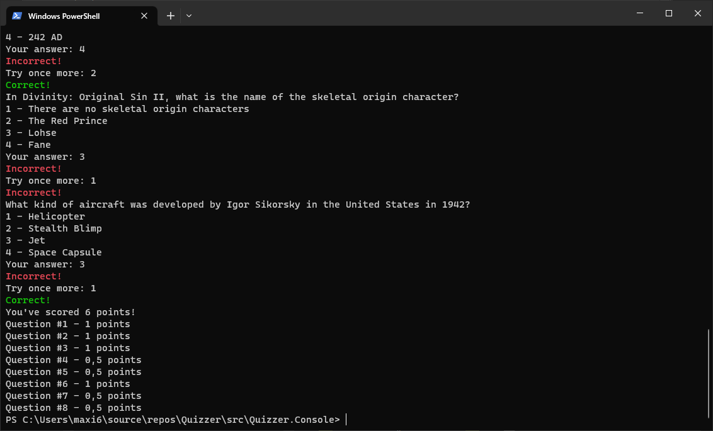

# Quizzer

This is a little sample project, consisting of two main parts:
1. Quizzer.Console - A console trivia quiz application
2. Quizzer.TriviaServer - A web application that can be used to create questions.

The console application by default will use the [OpenTrivia Database](https://opentdb.com/), but can be configured to use our API compatible web application instead.



## Running

To run the quiz, simply execute the Quizzer.Console project

```
cd src/Quizzer.Console
dotnet run
```

If you want to run the Trivia Server execute the Quizzer.TriviaServer project

```
cd src/Quizzer.TriviaServer
dotnet run
```

To make sure that the quiz will use your self-hosted trivia server, update the configuration inside `src/Quizzer.Console/Program.cs`.
